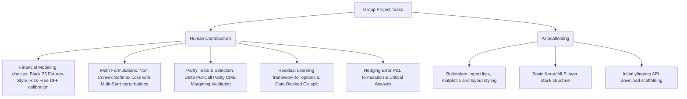

# 21046 — Data Science and Machine Learning for Finance
**Graduate Takehome Assignment (Group 12 Submission) — A.Y. 2025/2026**  
**Institution:** Università Bocconi, Milan, Italy  
**Course Director:** Prof. Francesco Corielli  

---

## 📖 Executive Summary
This repository contains the group assignment (takehome project) for the **21046 Data Science and Machine Learning for Finance** course. The project applies statistical modeling, classical machine learning, and deep learning techniques to two core quantitative finance problems:
1. **Question 1 — Statistical Return Analysis & Median-MAD Portfolio Optimization:** A rigorous evaluation of S&P 500 stock return properties, dimensionality reduction (PCA and Keras autoencoders), and a comparison of linear proxy vs. non-convex, multi-start exact optimization algorithms for Median-MAD portfolios.
2. **Question 2 — Option Delta Hedging with Machine Learning & Deep Learning:** Modeling and approximating option hedge ratios (Delta) for CME E-Mini S&P 500 futures options. It compares linear baselines (Ridge/Lasso), tree-based ensembles (Random Forest, Gradient Boosting), and Deep Neural Networks (raw MLPs, Residual NNs) against analytical Black 76 benchmarks under a **Self-Financing Replication Test**.

---

## 📁 Repository Structure

*   [src/21046_group12_submission.ipynb](file:///Users/stefanograziosi/Documents/GitHub/21046-mlf-ps/src/21046_group12_submission.ipynb): Main Jupyter Notebook containing the data pipelines, model definitions, training loops, evaluation grids, and visualizations.
*   [data/](file:///Users/stefanograziosi/Documents/GitHub/21046-mlf-ps/data): Directory containing raw and diagnostic data.
    *   `takehome21046data2026.csv`: CME option chain prices, underlying futures, and deltas (Dec 2023).
    *   `sp500_adj_close.csv`, `sp500_constituents.csv`, `sp500_market_caps.csv`: Assets pricing data for S&P 500 constituents.
    *   `warmstart_multistart_homogeneous_comparison.csv`: Diagnostic summary of the portfolio optimization.
*   [docs/](file:///Users/stefanograziosi/Documents/GitHub/21046-mlf-ps/docs): Official guidelines, questions, and course syllabus.
    *   [instructions.md](file:///Users/stefanograziosi/Documents/GitHub/21046-mlf-ps/docs/instructions.md): Complete guidelines for the elective assignment.
    *   [syllabus_21046.md](file:///Users/stefanograziosi/Documents/GitHub/21046-mlf-ps/docs/syllabus_21046.md): Detailed course content, scheduling, and prerequisites.
    *   [q1.md](file:///Users/stefanograziosi/Documents/GitHub/21046-mlf-ps/docs/q1.md) and [q2.md](file:///Users/stefanograziosi/Documents/GitHub/21046-mlf-ps/docs/q2.md): Isolated prompts for the respective questions.

---

## ⚙️ Installation & Getting Started

### Prerequisites
*   Python 3.10+
*   Jupyter Notebook / JupyterLab environment (or Google Colab)
*   Recommended libraries: `numpy`, `pandas`, `scikit-learn`, `tensorflow`/`keras`, `scipy`, `matplotlib`, `plotly`, `shap`, `statsmodels`

### Setup Virtual Environment
Create and activate a virtual environment, then install dependencies:
```bash
# Initialize venv
python3 -m venv .venv
source .venv/bin/activate

# Install required packages
pip install --upgrade pip
pip install numpy pandas scikit-learn tensorflow keras scipy matplotlib plotly shap statsmodels yfinance
```
Launch the Jupyter interface:
```bash
jupyter notebook
```
Open [src/21046_group12_submission.ipynb](file:///Users/stefanograziosi/Documents/GitHub/21046-mlf-ps/src/21046_group12_submission.ipynb) and run cells.

---

## 📈 Question 1 — Statistical Analysis & Median-MAD Portfolio Optimization

### 1. Data Pipeline & Survivorship Bias
The code downloads S&P 500 constituents prices over a 10-year historical window. Dropping stocks with missing values leaves **461 out of 500 companies**. 
> [!WARNING]
> This introduces a non-trivial **survivorship bias**. The excluded companies are systematically the worst-performing or bankrupted ones, which artificially inflates the historical performance of the remaining sample compared to the actual market index.

### 2. Stylized Facts of Returns
*   **Mean vs. Median:** The mean return is on average lower than the median return, driven by negative skewness. Large negative drawdowns trigger panic-selling, generating fat left tails.
*   **SD vs. MAD:** Standard Deviation (SD) is consistently higher than Mean Absolute Deviation (MAD), highlighting SD's quadratically growing sensitivity to extreme outliers.
*   **Return Dispersion:** Plotting median return vs. MAD reveals a very weak correlation. The median captures stable central tendency, whereas MAD measures dispersion.

### 3. Advanced Statistical Analyses
*   **Distribution Testing:** Average daily return series fail standard normality tests (Jarque-Bera, Kolmogorov-Smirnov). The **Lilliefors test** is preferred over K-S since the mean and variance are estimated from the sample itself.
*   **PCA (Principal Component Analysis):** PC1 represents the market factor. High loadings concentrate in financial and interest-rate-sensitive stocks (e.g., BlackRock), while countercyclical assets (Kroger, gold miners like Newmont) have low loadings. Rolling PC1 correlation peaked in **March 2020 (COVID-19 market panic)**, showing how systemic crises coordinate asset returns.
*   **Clustering:** Hierarchical clustering with 8 clusters (chosen via the elbow method vs. Davies-Bouldin index) shows Energy and Materials to be concentrated and distinct, whereas Communications (ranging from Meta to traditional telecom) are highly dispersed.
*   **Autoencoder Clustering:** A Feedforward Autoencoder with a **3-neuron bottleneck** was trained on return series augmented with volatility. To mitigate the low $R^2$ (< 0.2) of extremely noisy daily returns, the group used weekly and annual frequencies. Projecting the bottleneck layer to 3D space reveals sector-related latent components (e.g., Energy and Utilities cluster together), though cluster composition proved highly sensitive to architecture changes.

### 4. Portfolio Optimization: Proxy vs. True Method
The goal is to construct 10 portfolios with target medians ($m_{\text{target}}$) equi-spaced between the minimum and maximum median returns of the sample, while minimizing the Mean Absolute Deviation. Because the median function is non-smooth, the optimization problem is non-convex.

#### Method A: The Proxy Method (Linear Programming)
Instead of the realized median, we minimize the absolute deviation of the portfolio returns around a *fixed* target median:
$$\min_w \frac{1}{T}\sum_{t=1}^T |(Rw)_t - m_{\text{target}}| \quad \text{s.t.} \quad \sum_i w_i = 1, \; w_i \geq 0$$
Since $m_{\text{target}}$ is constant, this is easily solvable via linear programming. However, the realized median of the resulting portfolio is not guaranteed to equal $m_{\text{target}}$.

#### Method B: The True Method (Non-Convex Optimization)
The true problem is solved by minimizing a joint loss function of the true MAD and a penalty for target median deviations:
$$L(w) = \text{MAD}(w) + \lambda |\text{median}(Rw) - m_{\text{target}}|$$
$$\text{where} \quad \text{MAD}(w) = \frac{1}{T}\sum_{t=1}^T |(Rw)_t - \text{median}(Rw)|$$
To enforce positive weights summing to one, we optimize unconstrained weights $\theta$ and map them via the **softmax function**: $w_i = \frac{e^{\theta_i}}{\sum_j e^{\theta_j}}$. We employ a **multi-start heuristic** (starting from the proxy weights plus random perturbations) and sweep the penalty coefficient $\lambda \in [10, 10000]$.

### 5. Portfolio Optimization Results (In-Sample Comparison)
The optimization outputs are saved in `data/warmstart_multistart_homogeneous_comparison.csv`. The exact results are summarized below:

| Target Median | Proxy Realized Median | Proxy MAD | True Realized Median | True MAD | Chosen $\lambda$ | Best Start Heuristic |
|:---:|:---:|:---:|:---:|:---:|:---:|:---:|
| -0.000513 | 0.000676 | 0.005780 | -0.000513 | 0.014488 | 1000 | Random Perturbation |
| -0.000249 | 0.000674 | 0.005776 | -0.000249 | 0.010975 | 30 | Random Perturbation |
| 0.000015 | 0.000651 | 0.005773 | 0.000015 | 0.008070 | 100 | Random Perturbation |
| 0.000279 | 0.000616 | 0.005769 | 0.000279 | 0.006302 | 10000 | Random Perturbation |
| 0.000543 | 0.000611 | 0.005768 | 0.000543 | 0.006133 | 3000 | Random Perturbation |
| 0.000807 | 0.000730 | 0.005768 | 0.000807 | 0.005866 | 10 | Proxy Start |
| 0.001072 | 0.000711 | 0.005771 | 0.001072 | 0.006425 | 30 | Random Perturbation |
| 0.001336 | 0.000751 | 0.005774 | 0.001336 | 0.007395 | 10000 | Random Perturbation |
| 0.001600 | 0.000730 | 0.005777 | 0.001600 | 0.009456 | 10 | Random Perturbation |
| 0.001864 | 0.000728 | 0.005782 | 0.001864 | 0.010632 | 30 | Random Perturbation |

> [!NOTE]
> *   **Median Matching:** The True Method matches the target medians perfectly (median error = 0), whereas the Proxy Method's realized medians cluster tightly around 0.0006–0.0007 regardless of the target.
> *   **MAD Dispersion U-Shape:** The True Method's MAD traces a U-shape. Diversification is maximized around the central target ($0.0008$), and forcing extreme medians increases concentration in a few extreme stocks, blowing up the MAD.

### 6. Out-of-Sample (OOS) Generalization & Overfitting
When evaluated on the test set, the behaviors invert:
*   **True Method Overfitting:** The exact optimization constraints break down out-of-sample; the realized test medians drift significantly from their targets, and the test MADs become highly unstable.
*   **Proxy Method Generalization:** The simpler Proxy Method remains highly robust. Its test MAD stays flat and bounded around 0.005.
*   *Key Takeaway:* In noisy, small-sample financial environments, simpler linear approximations (Proxy) generalize better than non-convex exact fits (True Method) due to the bias-variance tradeoff.

---

## 📈 Question 2 — Option Delta Hedging with Machine Learning & Deep Learning

### 1. Feature Engineering
The target variable is the quoted option Delta. Inputs consist of:
1.  **Underlying Price ($F$):** Settlement price of E-Mini S&P 500 Dec-2023 futures.
2.  **Maturity ($\tau$):** Time to expiry (Dec 15, 2023), expressed in business-day fractions ($\text{days}/252$).
3.  **Strike Price ($K$):** Discrete strikes ($4000, 4200, 4400, 4600, 4800$).
4.  **Realized Volatility ($\sigma^{\text{real}}$):** 21-day annualized historical standard deviation.
5.  **Moneyness Representions:** $F/K$ and $\ln(F/K)$ to capture scale-invariance.

### 2. Black 76 Benchmark & CME Convention Testing
Since the underlying is a futures contract, we use the **Black 76 model** rather than Black-Scholes. The option pricing formulas are:
$$C = e^{-r\tau}\bigl[F N(d_1) - K N(d_2)\bigr], \qquad P = e^{-r\tau}\bigl[K N(-d_2) - F N(-d_1)\bigr]$$
$$d_1 = \frac{\ln(F/K) + \frac{1}{2}\sigma^2\tau}{\sigma\sqrt{\tau}}, \qquad d_2 = d_1 - \sigma\sqrt{\tau}$$

There are two potential delta conventions:
*   **Premium-Paid (PP):** $\Delta^{\text{PP}}_{\text{call}} = e^{-r\tau}N(d_1)$ (discounted)
*   **Futures-Style (FS):** $\Delta^{\text{FS}}_{\text{call}} = N(d_1)$ (undiscounted)

We test the dataset convention using **Put-Call Parity on Deltas**, which holds exactly:
$$\Delta_{\text{call}} - \Delta_{\text{put}} = \begin{cases} e^{-r\tau} & \text{(Premium-Paid)} \\ 1 & \text{(Futures-Style)} \end{cases}$$
The empirical evaluation on the market quotes yields:
*   Mean $\big|\Delta_{\text{call}} - \Delta_{\text{put}} - e^{-r\tau}\big| = \mathbf{0.04018}$ (Premium-Paid)
*   Mean $\big|\Delta_{\text{call}} - \Delta_{\text{put}} - 1\big| = \mathbf{0.01952}$ (Futures-Style)
> [!IMPORTANT]
> The empirical parity test confirms that the CME E-Mini S&P 500 options follow the **Futures-Style** (FS) undiscounted convention. The analytical benchmarks are constructed accordingly.

We define two analytical benchmarks:
1.  **RV-Black:** Fed with constant realized historical volatility $\sigma^{\text{real}}$.
2.  **IV-Black:** Fed with option-specific implied volatility $\sigma^{\text{iv}}$ back-solved via Brent's numerical inversion on quote prices. IV-Black serves as the oracle upper bound (reconstructing market delta with MAE $\approx 0.005$).

### 3. Machine Learning & Deep Learning Models
To model the options data chronologically and prevent leakage, we use a 5-fold **Date-Blocked Cross-Validation** (ensuring all option contracts on a given trading date fall into the same fold).

*   **Supervised Targets:** Models are trained on both the **Raw Target** (quoted delta) and the **Residual Target** ($r = \Delta^{\text{mkt}} - \Delta^{\text{RV-Black}}$), learning the smile correction.
*   **ML Estimators:** Ridge, Lasso, Random Forest, and Gradient Boosting.
*   **Keras Deep Feedforward MLP:**
    *   *Input Layer:* 4 features (moneyness, log-moneyness, $\tau$, $\sigma^{\text{real}}$).
    *   *Hidden Layers:* Dense 64 $\to$ Dense 32 $\to$ Dense 16 (with Batch Normalization and Dropout = 0.20 to prevent overfitting).
    *   *Output Layer:* Sigmoid for call delta ($\in [0, 1]$); shifted Sigmoid ($\sigma(z) - 1$) for put delta ($\in [-1, 0]$).
    *   *Loss:* Mean Squared Error; Optimizer: Adam ($10^{-3}$ learning rate); Early Stopping (patience = 20 on validation loss).
*   **Residual Neural Network (RNN):** Learns the delta residuals directly: $\hat{\Delta}^{\text{RNN}} = \Delta^{\text{RV-Black}} + \text{MLP}(\text{features})$.
*   **Robustness Check:** A rolling walk-forward validation validates the residual networks chronologically.

### 4. Option Delta Model Comparisons
The models were evaluated out-of-sample on the test set.

*   **Raw-Target Performance:** None of the ML/DL models trained on raw targets beat the **RV-Black** benchmark. Raw models post MAEs in the 0.08–0.11 range, whereas RV-Black achieves an MAE of **~0.034** (calls) and **~0.040** (puts).
*   **Why Raw ML Fails:**
    1.  *Function-class Bias:* Axis-aligned decision trees (RF, XGBoost) and piecewise-linear ReLU networks Struggle to replicate the smooth, exponentially monotonic curvature of $\Phi(d_1)$ given limited panel strikes.
    2.  *Prior Structuring:* Analytical models embed no-arbitrage boundary conditions (asymptotic convergence to 0 and 1) which black-box models must waste capacity learning from scratch.
*   **Where ML Genuinely Helps (Residual learning):** Asking the model to learn the residual smile correction ($\Delta^{\text{market}} - \Delta^{\text{RV-Black}}$) isolates the volatility skew. The residual Gradient Boosting and Residual NN achieve a test MAE close to RV-Black while capturing the strike-dependent smile correction.

### 5. Self-Financing Replication Test (Hedge Error)
For each business day $t$, we compute the daily hedge error of a replicating portfolio (long one call, short $\Delta$ futures):
$$\varepsilon_t(\Delta) = (C_{t+1} - C_t) - \Delta_t(F_{t+1} - F_t) - r C_t \Delta t$$
Accumulating $\varepsilon_t$ over time measures the portfolio drift.
*   **Results:** The quoted market delta and **IV-Black** yield the lowest cumulative errors.
*   **RV-Black** dominates the ML/DL raw estimators.
*   **Residual ML** models significantly outperform raw-target ML models, yielding lower daily tracking RMSE and tighter error dispersion.

---

## 🤖 Generative AI Evaluation & Disclosures

### 1. Performance Critique of Colab AI & Copilot
While GenAI was highly efficient for drafting data loading scripts, scaling boilerplate, and suggesting diagnostic tests (e.g., Lilliefors, Davies-Bouldin), it exhibited critical shortcomings:
*   **Hidden Approximations:** In the portfolio optimization section, the AI repeatedly proposed replacing the true portfolio median with a weighted average of individual stock medians. This converted the problem into a simple linear program, but produced portfolios that completely failed to meet the target median constraint.
*   **Theoretical Blind Spots:** AI suggested using the Central Limit Theorem to explain the normality of stock returns, ignoring the prerequisite that return series are not independent and identically distributed ($i.i.d.$).
*   **Hallucinated Explanations:** When rolling PC1 correlations dropped in November 2017, AI confidentially explained it via a sector rotation from Tech to Financials. The team cross-verified the sector correlations and found the explanation to be historically inconsistent.
*   **Code Instability:** Early optimization code generated by AI was numerically unstable, causing gradient descent on the non-differentiable median loss to diverge.

### 2. Team vs. AI Contribution Breakdown

*(Refer to Section 7.7 of the submission notebook for the per-cell AI disclosure tags).*

---

## 🎓 Honor Code & References
This project adheres to the **Università Bocconi Honor Code**.
*   Black, F. (1976). *The pricing of commodity contracts*. Journal of Financial Economics.
*   Hull, J. C. (2022). *Options, Futures, and Other Derivatives* (11th ed.), Pearson.
*   Lundberg, S. M., & Lee, S.-I. (2017). *A Unified Approach to Interpreting Model Predictions*. Advances in Neural Information Processing Systems (SHAP).
*   Hutchinson, J. M., Lo, A. W., & Poggio, T. (1994). *A Nonparametric Approach to Pricing and Hedging Derivative Securities Via Learning Networks*. Journal of Finance.
